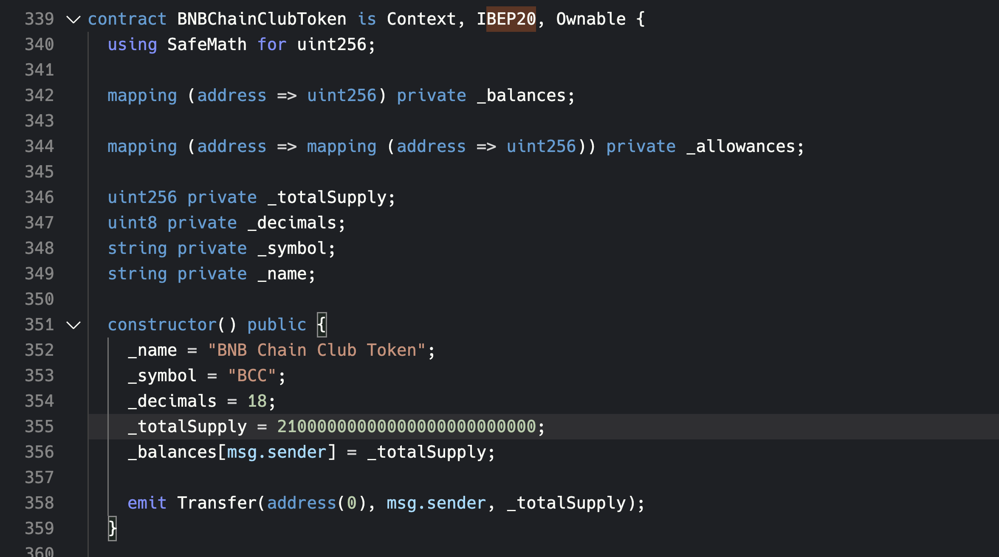
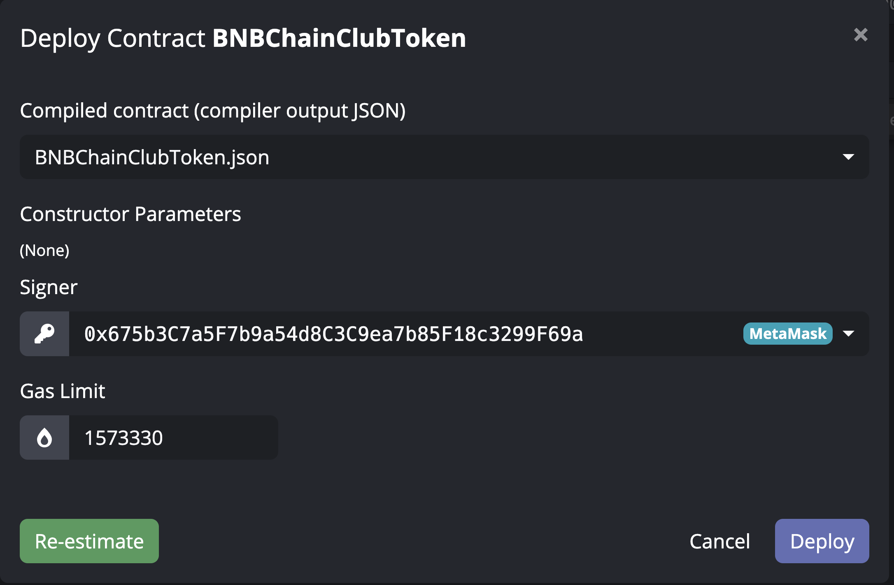

# Issuing a token on BNB Chain tutorial

## Prerequisites
**BNB Beacon Chain (BC)**: Beacon Chain is a blockchain developed by Binance and its community that implements a vision of a decentralized exchange (DEX) for digital assets. (DEX on Beacon Chain has been decommissioned on Aug. 2022). At the heart of Beacon Chain is a highly performant matching engine built on distributed consensus that aims to replicate the <1 second trading efficiency of current centralized exchanges. Beacon Chain is not EVM-compatible and doesn’t support smart contracts.

**BNB Smart Chain (BSC)**: BNB Smart Chain is an innovative solution to bring programmability and interoperability to Beacon Chain. BNB Smart Chain relies on a system of 21 active validators with Proof of Staked Authority (PoSA) consensus that can support short block time and lower fees.

**BEP2**: a token standard for fungible tokens on BNB Beacon Chain, describes a common set of rules for token management within the Binance Chain ecosystem. It introduces the following details of a token on Beacon Chain:

- What information makes a token on Beacon Chain
- What actions can be performed on a token on Beacon Chain

<https://github.com/bnb-chain/BEPs/blob/master/BEP2.md>

**BEP20**: a token standard for fungible tokens on BNB Smart Chain, defines the implementation of APIs for token smart contracts. It is proposed by deriving the ERC20 protocol of Ethereum and provides the basic functionality to transfer tokens, allow tokens to be approved so they can be spent by another on-chain third party, and transfer between Binance Chain and Binance Smart Chain
<https://github.com/bnb-chain/BEPs/blob/master/BEP20.md>

## Tools used in this tutorial
- Black IDE (To create, compile and interact with Smart Contract)
- bnbcli (BNB Beacon Chain Command Line Interface) <https://github.com/bnb-chain/node/releases>
- Bscscan (the browser of BNB Smart Chain) <https://testnet.bscscan.com/> 
- BNB Beacon Chain Explorer (the browser of BNB Beacon Chain) <https://testnet-explorer.binance.org/> 
- Binance Wallet (Wallet Extension)

## Steps 
Since BSC was created after BC, there are some tokens on BC issued earlier are not existing on BSC yet. In the below steps we will issue a token called BCC (BNB Chain Club token) with a total circulation of 21,000,000 on testnet of BNB Beacon Chain and BNB Smart Chain (BSC).

We will issue 21,000,000 BCC on BC first then 21,000,000 BCC on BSC and process token binding. After binding, those 21,000,000 BCC on BSC will be locked into system build-in smart contract TokenHub. The total circulation will be 21M as we desired. 

On the other hand, if a token is issued on BSC first and want it to circulate on BC, could call the mirror function of TokenManager, which is easier. This tutorial will not cover this, please refer to <https://docs.bnbchain.org/docs/mirror> 
### Issue token BCC on BNB Beacon Chain
1. Import your account mnemonic into tbnbcli and set a passphrase

&nbsp;&nbsp;&nbsp;&nbsp;`$ tbnbcli keys add isaackey --recover`

&nbsp;&nbsp;&nbsp;&nbsp;(The key name after add is customized, here just use isaackey for an example.)

2. Import your account mnemonic into tbnbcli and set a passphrase
3. Issue BCC on BC by

&nbsp;&nbsp;&nbsp;&nbsp;`$ tbnbcli token issue --token-name "BNB Chain Club token" --symbol BCC --total-supply 2100000000000000 --from isaackey  --chain-id Binance-Chain-Ganges   --node=data-seed-pre-2-s1.binance.org:80`

- ***token-name***: it is the long official name, such as "Binance Coin". It is limited to 32 characters.
- ***symbol***: identifier of the token. The length of symbol should be between 2 and 8. 
- ***total-supply***: an int64 boosted by **1e8** for decimal part. The max total supply is 90 billion.
- **from**: the sender address of the transaction and it will become the owner of the token, all created tokens will be in this account.
- ***chain-id***: “Binance-Chain-Tigris” for Beacon Chain Mainnet, “Binance-Chain-Ganges” for Beacon Chain Testnet
- ***node***: RPC endpoint of testnet
- ***mintable***: that means whether this token can be minted in the future. To set the tokes to be mintable, you need to add --mintable, otherwise, just omit this field to set this token to be non-mintable.
4. Check transaction in BNB Beacon Chain Explorer <https://testnet-explorer.binance.org/tx/F823D2E2F672366BD749DA93BCF67F3FBE3D04CFA000F4F5EFCA28DD84CA6675>. Fee on testnet is fixed at 10 BNB. Record the Asset name BCC-F82
5. Soon we will see this token appear under BC address in Binance Wallet 
### Issue token BCC on BNB Smart Chain
1. In Black IDE, connect with your Metamask and choose network to BNB Chain Testnet.
2. Create a project and choose ERC20 template

2. Open ERC20.sol under contracts folder and change the contract name to "BNBChainClubToken".

3. Check Solidity Compiler version at bottom right corner, make sure it is 0.8.0, which is the same as pragma version in the code.

4. Click Build and Deploy, when deploy choose BNBChainClubToken.json (This is the ABI file of the smart contract), give name as "BNB Chain Club Token", symbol as "BCC" and totalSupply as 21000000000000000000000000.
6. Check transaction in Bscscan. No extra fee, just a normal gas fee. Record the address of the token contract.
7. We could add this token contract address to Binance wallet under BSC address.
### Bind token BCC on BNB Beacon Chain & BNB Smart Chain
1. Send bind transaction from Beacon Chain side

&nbsp;&nbsp;&nbsp;&nbsp;`$ tbnbcli bridge bind --symbol BCC-XXX --amount 0 --expire-time 1666219723 --contract-address 0x92b16A95fBc248d933F87dF89fC6Bcd18C45BcE3 --contract-decimals 18 --from isaackey --chain-id Binance-Chain-Ganges --node=data-seed-pre-2-s1.binance.org:80`

- ***symbol***: full identifier of the token we get from above
- ***amount***: the amount to be locked on **BNB Beacon Chain**. Here we want all BCC token stay on BC first, hence we lock 0 here.
- ***expire-time***: when this bind request will be expired in UNIX time, need to be 600 seconds after now
- ***contract-address***: token contract address on BSC
- ***contract-decimals***: same as the code value in the token contract

Crosschain Bind Fee on testnet is fixed 0.1 BNB
### Approve Bind Request on BNB Smart Chain
1. In Black IDE, click on Contract and input our token contract address, it will show available functions to interact with the contract. We choose approve() to grant transfer permission to the system build-in contract TokenManager 0x0000000000000000000000000000000000001008

spender is TokenManger. 

amount is 21000000000000000000000000 which is all of the circulation (1e18) on **BNB Smart Chain**

<https://testnet.bscscan.com/tx/0x4c9ca7804c151e9fc4b4bda68dabf60b4fb6bd63123172c1017f33b3da9520c3> 

2. Input 0x0000000000000000000000000000000000001008 in Black IDE, you will see below because it doesn’t have ABI file. Get ABI file of TokenManager from here: <https://github.com/bnb-chain/bsc-genesis-contract/blob/master/abi/tokenmanager.abi> Add it to ABI Storage

3. After ABI is imported, choose approveBind(), we will let TokenManager complete the binding by transferring our specified amount to pegged account TokenHub.

BNB to Send is the fee charged by cross-chain service. TokenManager will call TokenHub, then TokenHub initiates a cross-chain transaction to BC to complete the binding. So there will be a cross-chain transaction and incur a fee. Normally it should be 0.01 BNB.

contractAddr is our token contract address

bep2Symbol is the full token name on Beacon Chain

These transactions will only have a normal gas fee. 

4. Confirm the bind result by

&nbsp;&nbsp;&nbsp;&nbsp;`$ tbnbcli token info --symbol BCC-XXX --chain-id Binance-Chain-Ganges --node=data-seed-pre-2-s1.binance.org:80`

You should see "contract\_address" and "contract\_decimals" returned in result.

5. Check the balance of BCC under BSC address in Binance wallet, it should become 0
6. The whole bind has finished. The total cost is ~10.2 BNB. We set total circulation to 21,000,000 BCC on two chains. Now all BCC are on BC, and the amount on BSC has been locked into TokenHub. We could do a cross-chain transfer from BC to BSC now.

In the above steps, it's worth noting that there is no token name/symbol limitation. You could name it any as you wish. This means there could be several BNB/BUSD/USDT/CAKE .etc tokens on the chain but only one will be the token we want to interact with. Always be careful when dealing with token addresses. Usually, CoinMarketCap will list the official addresses of a token on different chains.

