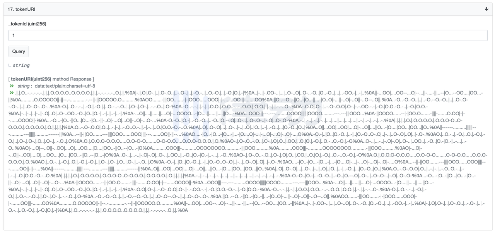
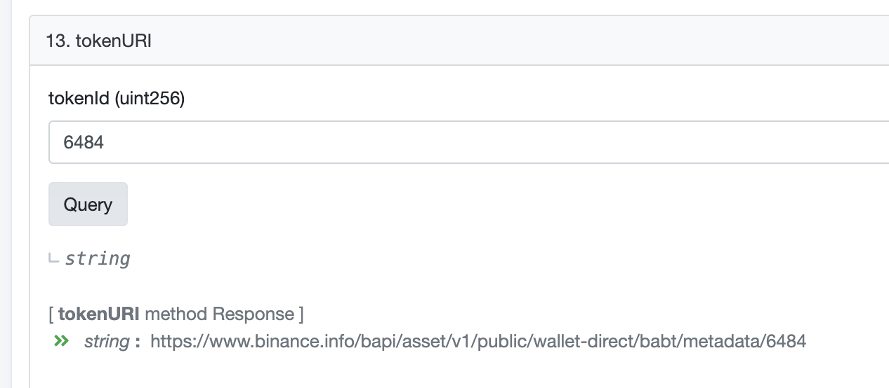
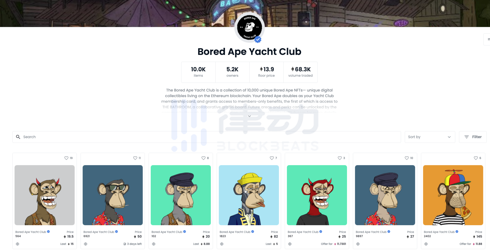
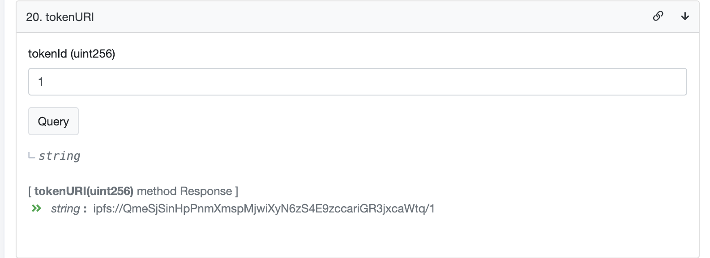
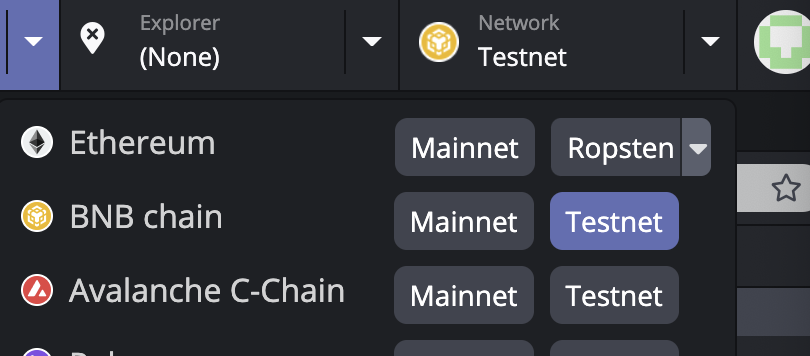
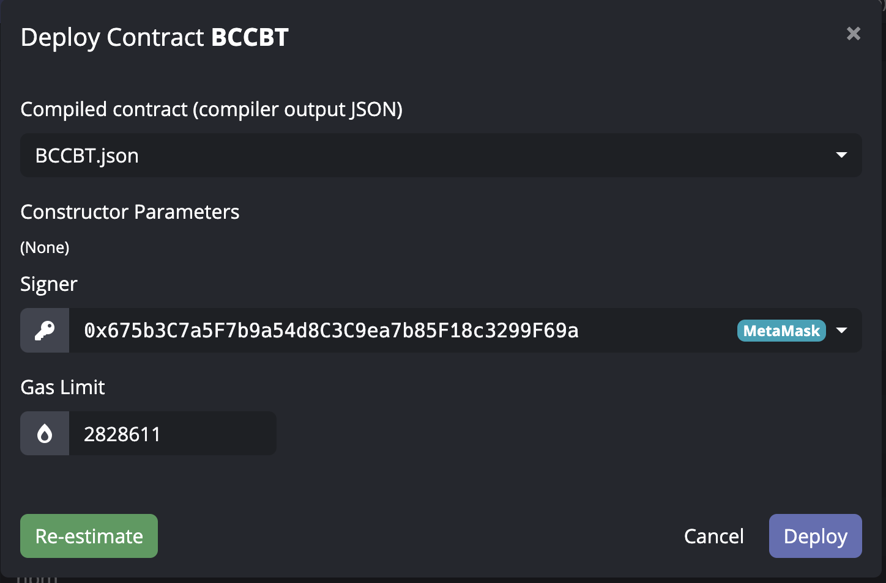
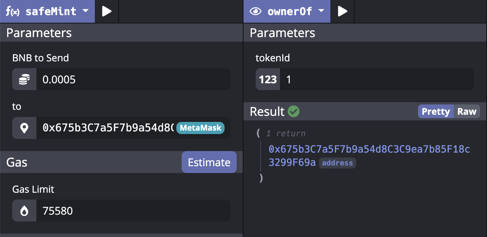
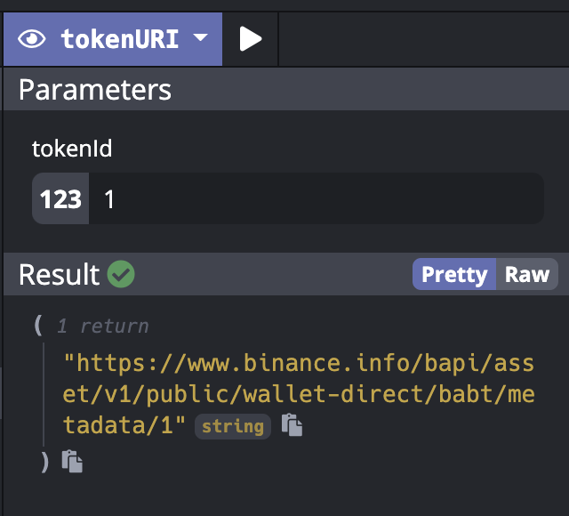

# Issuing an NFT on BNB Chain tutorial

## Prerequisites
**NFT:** Non-fungible token. On BSC, cryptos are fungible token which following BEP20 standard (On Ethereum it’s ERC20). A non-fungible token (NFT) is a unique digital identifier that cannot be copied, substituted, or subdivided, that is recorded in a blockchain, and that is used to certify authenticity and ownership. The ownership of an NFT is recorded in the blockchain and can be transferred by the owner, allowing NFTs to be sold and traded.

**BEP-721:** BEP-721 is a BNB Smart Chain (BSC) token standard that allows for the creation of non-fungible tokens (NFTs). It’s an extension of Ethereum’s ERC-721, one of the most commonly used NFT standards and is compatible with the Ethereum Virtual Machine (EVM). Each NFT is unique and is not interchanged with any other token.

BEP-721 tokens allow you to tokenize the ownership of data and attach to it a unique identifier. This aspect makes the token one of a kind and vastly different from BEP-20 tokens. WIth BEP-20, developers can create multiple identical tokens within one smart contract. However, with BEP-721, each token is assigned a different token ID.

<https://academy.binance.com/en/glossary/bep-721> 

**IERC721 & IERC721Metadata**: The IERC721 is the interface definition present in the OpenZeppelin library. The contract defines all basic events and functions that the ERC721 NFT standard constitutes. IERC721Metadata is the optional extension that adds name, symbol, and token URI, almost always included.

In IERC721, there are 3 events and 9 methods.

```
interface IERC721 is IERC165 {

    event Transfer(address indexed from, address indexed to, uint256 indexed tokenId);

    event Approval(address indexed owner, address indexed approved, uint256 indexed tokenId);

    event ApprovalForAll(address indexed owner, address indexed operator, bool approved);

    function balanceOf(address owner) external view returns (uint256 balance);

    function ownerOf(uint256 tokenId) external view returns (address owner);

    function safeTransferFrom(address from, address to, uint256 tokenId, bytes calldata data) external;

    function safeTransferFrom(address from, address to, uint256 tokenId) external;

    function transferFrom(address from, address to, uint256 tokenId) external;

    function approve(address to, uint256 tokenId) external;

    function setApprovalForAll(address operator, bool approved) external;

    function getApproved(uint256 tokenId) external view returns (address operator);

    function isApprovedForAll(address owner, address operator) external view returns (bool);
}
```

In IERC721Metadata, there are 3 methods.

```
interface IERC721Metadata is IERC721 {

    function name() external view returns (string memory);

    function symbol() external view returns (string memory);

    function tokenURI(uint256 tokenId) external view returns (string memory);
}
```

<https://github.com/OpenZeppelin/openzeppelin-contracts/blob/master/contracts/token/ERC721/ERC721.sol> 

<https://www.binance.com/en/nft/collection/dodo-minions-538734608664449025?isBack=1>

<https://www.binance.com/en/nft/item/23084414> Token ID 16204

NFT metadata: <https://service-avatar.dodoex.io/api/v1/avatars/metadata/bsc/27285411598> 
### NFT Meta Data and Media Storage Types

1. No storage of media on chain. 

E.g. CryptoPunks. Obsolete solution. 


<https://www.larvalabs.com/cryptopunks> 

2. Stored on chain

Stored on chain forever with text that could generate images. This is expensive (on chain storage cost) and monotonous.




3. Centralized storage

Used a centralized web server to store. E.g. BABT

Need to maintain the web servers and owner of the web server could change metadata at anytime.

<https://bscscan.com/token/0x2b09d47d550061f995a3b5c6f0fd58005215d7c8#readProxyContract> 

<https://www.binance.info/bapi/asset/v1/public/wallet-direct/babt/metadata/6484>



4. Decentralized storage

Used decentralized storages like IPFS. E.g. Bored Ape Yacht Club

<https://etherscan.io/address/0xbc4ca0eda7647a8ab7c2061c2e118a18a936f13d#readContract>

ipfs://QmeSjSinHpPnmXmspMjwiXyN6zS4E9zccariGR3jxcaWtq/1 (Use Brave to view it)




## Tools used in this tutorial
- Black IDE online version (To create, compile and interact with Smart Contract)
- OpenZeppelin ERC721 smart contract 
- Brave Browser (Used as IPFS broswer)
- Bscscan (the browser of BNB Smart Chain) <https://testnet.bscscan.com/> 
- MetaMask Wallet (Browser Extension & Mobile)
## Steps 
In below steps, we will issue a very simple NFT called BNB Chain Club Bound Token (BCCBT) on BNB Smart Chain Testnet with 0.0005 BNB mint fee and borrow BABT image just for illustration. Source code just implemented several necessary methods. In general contract code from other projects will contain more methods.

1. Login into Black IDE, choose BNB chain Testnet and connect to your MetaMask



2. Create a project called “BCCBT” and choose ERC721 as Template 


3. Create a new .sol file called BCCBT, remove the existing GameItem.sol.


4. Copy source code from <https://github.com/BNB-Chain-Support/BNB-Chain-Club-Sharing/blob/main/Issuing%20an%20NFT%20on%20BNB%20Chain%20tutorial/BCCBT.sol> and choose Solc version to 0.8.4


- Here we use BABT image address as \_baseTokenURI
- Set mint fee as 0.0005
- Create the contract with name “BNB Chain Club Token” and symbol “BCCBT”
Above are all configurable.

5. Edit default project settings, change main file to BCCBT.sol and Smart contract to deploy to BCCBT.json.


6. Build and Deploy the smart contract




7. Click on the contract address and now we will mint the 1st NFT of our contract.


8. Choose safeMint method, input mint fee 0.0005BNB and address, then execute


9. Verify ownership by using ownerOf method and type tokenId which is 1 we just minted.



10. Now we will check this NFT in our wallet. Since MetaMask Browser Extension doesn’t support view NFT. We will use MetaMask mobile app version to check it.

Open MetaMask app and choose NFTs table, then Import NFTs


11. Input the NFT contract address we just created and token ID 1


12. Here we go, we could see the NFT in MetaMask now.


13. Click on the NFT and you will see detail information


Question: Why it is showing BABT and description as “Binance Account Bound Token”?

Answer: MetaMask here reads metadata info from TokenURI <https://www.binance.info/bapi/asset/v1/public/wallet-direct/babt/metadata/1> 


